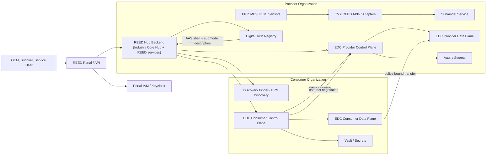

<!--
Eclipse Tractus-X - Industry Core Hub

Copyright (c) 2026 LKS Next
Copyright (c) 2026 Contributors to the Eclipse Foundation

See the NOTICE file(s) distributed with this work for additional
information regarding copyright ownership.

This work is made available under the terms of the
Creative Commons Attribution 4.0 International (CC-BY-4.0) license,
which is available at
https://creativecommons.org/licenses/by/4.0/legalcode.

SPDX-License-Identifier: CC-BY-4.0
-->

# REED Manufacturing Data Space Adaptation

This document adapts the Tractus-X Minimum Dataspace (MXD) and Industry Core Hub architecture for the REED project. The recommended approach is to build REED as a domain-specific Manufacturing Data Space layer on top of the Tractus-X stack, not as a new connector, registry, identity system, or policy engine.

REED should use Industry Core Hub as the pilot foundation because it already orchestrates EDC, Digital Twin Registry (DTR), submodel services, discovery, Keycloak, and the Tractus-X SDK. REED-specific work should therefore focus on bulky-part supply-chain logic, data classification, policy templates, partner onboarding, UI-facing authorization, access workflows, audit reporting, and use-case-specific submodel schemas.

## Architecture Decision

REED owns the manufacturing use-case layer:

- Supply-chain graph for OEM, supplier, and service-provider relationships.
- Bulky-part domain models, including large component identity, fixture handling, process capability, quality evidence, sustainability, and DPP/DMP traceability.
- Partner onboarding state, project membership, NDA state, supply-chain relationship, requested usage purpose, and asset sensitivity.
- UI/API authorization checks before calling EDC or exposing DTR/submodel metadata.
- Policy templates that translate REED business rules into EDC/ODRL policy definitions where possible.
- Audit records that connect participant, user, BPN, asset, purpose, contract agreement, timestamp, and transfer outcome.

Tractus-X components keep their existing responsibilities:

- EDC owns inter-company catalogue access, contract negotiation, agreement state, and policy-bound transfer.
- DTR owns AAS shell and submodel descriptor discoverability.
- Submodel services own sensitive payload storage and retrieval.
- Keycloak owns user login, roles, groups, token issuance, and organization/project claims.
- Discovery services own BPN-to-endpoint lookup and connector/DTR discovery.
- Vault owns secrets for EDC, clients, and service credentials.

## Target Architecture



In a pilot deployment, each participant should run its own REED/Industry Core Hub instance with its own EDC, DTR, submodel service, metadata database, Keycloak realm or tenant, and vault. A shared local test stack may still be used for development, but the architecture should preserve participant separation.

## Component Selection

| Layer | Recommended component | REED adaptation |
| --- | --- | --- |
| Portal and API | Industry Core Hub frontend and FastAPI backend | Extend with REED onboarding, supply-chain graph, bulky-part forms, access request workflow, and audit views. |
| Dataspace exchange | Tractus-X EDC provider and consumer control/data planes | Use EDC for catalogue requests, contract negotiation, agreement state, EDR issuance, and transfer. Do not bypass EDC for inter-company payload exchange. |
| Digital twin discovery | Tractus-X Digital Twin Registry | Publish AAS shells and submodel descriptors only. Keep confidential submodel payloads outside DTR. |
| Payload service | Industry Core Hub submodel dispatcher or a REED submodel service | Store and serve sensitive payloads after policy and contract checks. |
| Identity and access | Portal IAM / Keycloak plus participant identity where applicable | Put user roles, organization BPN, project groups, and assurance level into tokens. Keep dynamic project and asset context in REED. |
| Participant discovery | Discovery Finder, BPN Discovery, EDC Discovery | Resolve partner BPNs to connector and DTR endpoints for consumer flows. |
| Secrets | Vault | Store EDC keys, API keys, client secrets, and transfer credentials. |
| Persistence | PostgreSQL | Use Industry Core Hub metadata tables and add REED tables for access requests, asset sensitivity, DMP classification, project membership, and audit evidence. |

## Minimum REED Dataspace Setup

Use the MXD tutorial as the minimal EDC proving ground, and the Tractus-X Umbrella chart as the preferred integrated REED reference stack.

1. Prepare local tooling: JDK 17+, Docker, Kubernetes runtime such as KinD or Minikube, `kubectl`, Helm, Terraform for the MXD tutorial, and a POSIX shell.
2. Deploy a local Tractus-X stack with separate provider and consumer EDC control/data planes, Vault, PostgreSQL, DTR, submodel backend, Keycloak or IdentityHub, and discovery services.
3. Run the standard MXD health checks against both connectors to prove that catalogue, policy, contract definition, negotiation, and transfer APIs are reachable.
4. Stand up Industry Core Hub and configure provider and consumer endpoints for EDC, DTR, discovery, Keycloak, and the submodel dispatcher.
5. Seed REED asset classes, AAS/submodel semantic IDs, EDC policy templates, Keycloak roles, organization groups, and project groups.
6. Validate the standard Industry Core Hub provider and consumer flow with a generic submodel before adding REED-specific schema validation.
7. Replace the generic MXD assets with REED assets, for example `PartDigitalTwin`, `ProcessCapability`, and `QualityEvidence`.
8. Demonstrate one provider and one consumer exchanging a REED submodel through EDC under a policy-bound contract.

For local development, the MXD Alice/Bob naming can be mapped to REED roles:

- Alice: provider supplier exposing bulky-part metadata and selected payloads.
- Bob: consumer OEM or service provider discovering data and requesting contract-bound access.
- Asset 1/2: consortium-visible REED metadata such as part identity or DPP summary.
- Asset 3: restricted data such as process capability, simulation result, or quality evidence requiring a bilateral or service-specific policy.

### MXD-style bring-up (EDC proving ground)

The fastest way to prove that two REED participants can negotiate and transfer under a policy is to stand up the MXD dataspace first, then layer REED assets on top. The commands below follow the MXD tutorial; only the asset/policy seed step changes for REED.

Prerequisites: JDK 17+ with `JAVA_HOME` set, a local Kubernetes runtime (KinD recommended), Terraform, Helm, and a POSIX shell.

```shell
# 1. Create the cluster and ingress controller
cd /path/to/tutorial-resources/mxd
kind create cluster -n mxd --config kind.config.yaml
kubectl apply -f https://raw.githubusercontent.com/kubernetes/ingress-nginx/main/deploy/static/provider/kind/deploy.yaml
kubectl wait --namespace ingress-nginx \
  --for=condition=ready pod \
  --selector=app.kubernetes.io/component=controller \
  --timeout=90s

# 2. Build and load the runtime images
cd /path/to/tutorial-resources/mxd-runtimes
./gradlew dockerize
kind load docker-image --name mxd data-service-api tx-identityhub tx-catalog-server tx-issuerservice

# 3. Bring up the dataspace (Alice = REED provider, Bob = REED consumer)
cd /path/to/tutorial-resources/mxd
terraform init
terraform apply -auto-approve
# On ARM platforms (e.g. Apple Silicon) add -var="useSVE=true" if the JVM crashes with SIGILL
```

Verify both connectors are healthy and the seeded assets are reachable:

```shell
curl -X GET http://localhost/alice/health/api/check/liveness | jq
curl -X GET http://localhost/bob/health/api/check/liveness | jq

# List Alice's (provider's) assets, policies, and contract definitions
curl -X POST http://localhost/alice/management/v3/assets/request \
  -H "x-api-key: password" -H "content-type: application/json" | jq
curl -X POST http://localhost/alice/management/v2/policydefinitions/request \
  -H "x-api-key: password" -H "content-type: application/json" | jq
curl -X POST http://localhost/alice/management/v2/contractdefinitions/request \
  -H "x-api-key: password" -H "content-type: application/json" | jq
```

Once `isSystemHealthy: true` and the generic MXD assets resolve, replace the seed data with REED assets, policies, and contract definitions (see the Data Classification Matrix and Policy Model below) and re-run the catalogue, negotiation, and transfer requests from the MXD Postman collections against `alice` (provider) and `bob` (consumer). After the EDC layer is proven, deploy the integrated stack with the Tractus-X Umbrella chart and point Industry Core Hub at it rather than seeding EDC by hand.

## Data Classification Matrix

The initial matrix should be derived from the WP2 DMP, then converted into enforceable REED configuration. DTR and EDC catalogues should expose only discoverable metadata; sensitive payloads remain in the submodel service until a valid contract is accepted.

| REED asset class | AAS/submodel mapping | Discoverable metadata | Payload location | Default sensitivity | Default policy template |
| --- | --- | --- | --- | --- | --- |
| `PartDigitalTwin` | AAS shell plus serial part, batch, part type, or REED bulky component identity submodel | Part identifier, manufacturer BPN, owner BPN, lifecycle state, semantic IDs | Submodel service | Internal or consortium | Consortium metadata; contract required for serialized details. |
| `BillOfMaterial` | BoM submodel with parent/child references and supplier links | Parent part, child part references, supplier BPNs where permitted | Submodel service | Confidential supply-chain | Bilateral supplier or OEM-only. |
| `DigitalProductPassport` | DPP submodel using Catena-X DPP where applicable, extended with REED DMP references | DPP availability, material categories, compliance evidence type | Submodel service | Consortium to confidential | DPP read-only, purpose-bound, no onward sharing. |
| `ProcessCapability` | REED process capability submodel for machine envelope, operations, tolerances, lead time, and available processes | Capability category, process family, provider BPN, availability window | Submodel service | Confidential commercial | OEM-only, bilateral supplier, or simulation-service-only. |
| `FixtureHandlingStrategy` | REED handling and fixture strategy submodel | Handling strategy exists, equipment class, safety class | Submodel service | Confidential engineering | Bilateral supplier or time-limited pilot access. |
| `ProductionStatus` | REED production status submodel for capacity, order state, quality gates, and delivery state | Status category, part reference, update timestamp | Submodel service | Restricted operational | Project-only, time-windowed access. |
| `QualityEvidence` | Quality evidence submodel for inspection reports, certificates, and non-conformance summaries | Evidence type, certificate issuer, validity date | Submodel service | Confidential or regulated | OEM-only, auditor read-only, retention obligations. |
| `SimulationResult` | REED simulation result submodel for process simulation, energy use, risk, and lead-time estimation | Simulation type, asset category, created timestamp, provider BPN | Submodel service | Highly confidential | Simulation-service-only, delete-after-use, no AI training. |

Recommended classification attributes:

- `assetCategory`: one of the REED asset classes above.
- `sensitivity`: public metadata, consortium, restricted, confidential, regulated.
- `discoverability`: public, consortium, project, bilateral, hidden.
- `payloadStorage`: submodel service endpoint, file object store, external system reference.
- `allowedPurposes`: DPP read, supply-chain planning, simulation, quality audit, sustainability reporting, benchmark analytics.
- `obligations`: audit, delete after period, watermark, aggregate-only reporting, retain logs.
- `prohibitions`: no onward sharing, no AI training, no export outside geography, no raw download.

## Policy Model

REED should implement three policy layers aligned with T5.3.

| Layer | Decision point | Examples | Implementation owner |
| --- | --- | --- | --- |
| Catalogue access policy | Can a partner discover that metadata exists? | Partner BPN, project membership, supplier tier, NDA status, pilot flag, geography, organization role | REED evaluates context, EDC enforces coarse catalogue visibility. |
| Contract policy | Can a partner negotiate access? | Active membership, accepted framework agreement, usage purpose, time window, permitted BPNs, asset category, contract expiry | EDC/ODRL policy definitions generated from REED templates. |
| Usage policy | What obligations and prohibitions attach to the data? | No onward sharing, use only for REED pilot, delete after 90 days, no AI training, aggregate reporting only, retain audit logs, watermark files | EDC usage policy where expressible; REED audit and workflow enforcement for obligations outside EDC scope. |

Initial REED policy templates:

| Template | Intended use | Core constraints |
| --- | --- | --- |
| Public metadata | Non-sensitive catalogue discovery | Asset category is metadata-only; payload is not exposed. |
| Consortium-only | REED pilot members discovering shared metadata | Membership active, REED project group, recognized BPN. |
| Bilateral supplier | OEM and named supplier exchange | Provider BPN, consumer BPN, project membership, NDA active, purpose allowed. |
| OEM-only | Supplier exposes sensitive engineering or quality data to an OEM | Consumer role is OEM, permitted OEM BPN, contract expiry. |
| Simulation-service-only | Service provider processes a specific simulation or optimization dataset | Service provider BPN, purpose is simulation, dataset ID scoped, delete-after-use obligation. |
| DPP-read-only | DPP/DMP traceability and compliance evidence | Purpose is DPP read or sustainability reporting, no onward sharing, read-only access. |
| Time-limited pilot access | Short-lived pilot exchange | Contract validity window, project membership, audit required. |
| Anonymized benchmark access | Aggregated benchmark or sustainability reporting | Payload is anonymized or aggregated, no re-identification, no raw download. |

Example EDC/ODRL policy shape for a REED contract policy:

```json
{
  "permission": [
    {
      "action": "odrl:use",
      "constraints": [
        {
          "leftOperand": "cx-policy:Membership",
          "operator": "odrl:eq",
          "rightOperand": "active"
        },
        {
          "leftOperand": "cx-policy:FrameworkAgreement",
          "operator": "odrl:eq",
          "rightOperand": "DataExchangeGovernance:1.0"
        },
        {
          "leftOperand": "cx-policy:UsagePurpose",
          "operator": "odrl:eq",
          "rightOperand": "reed.pilot.process-simulation:1"
        }
      ]
    }
  ],
  "prohibition": [],
  "obligation": [
    {
      "action": "reed:audit",
      "constraint": {
        "leftOperand": "reed:retentionDays",
        "operator": "odrl:eq",
        "rightOperand": "90"
      }
    }
  ]
}
```

## Identity And Context-Based Authorization

Use Keycloak/OIDC for user authentication and REED backend checks for application authorization.

Token claims should include:

- `sub`, `preferred_username`, and user identity.
- Organization BPN and participant role.
- Realm roles such as `reed-admin`, `oem-manager`, `supplier-owner`, `service-provider`, `auditor`, and `viewer`.
- Project groups and organization groups.
- Assurance level or onboarding state where available.

REED backend context should include:

- Active project and pilot phase.
- Part ownership, manufacturer BPN, current data owner BPN, and supply-chain relationship.
- NDA state, framework agreement state, and contract state.
- Requested usage purpose and requested asset class.
- Asset sensitivity and DMP classification.
- Existing EDC agreement ID, transfer ID, and expiry.

Authorization sequence:

1. Validate the user token with Keycloak.
2. Resolve user organization, BPN, roles, groups, and project membership.
3. Load REED asset context and DMP classification.
4. Check UI/API permission in REED before calling EDC or DTR.
5. If inter-company access is requested, select the matching EDC policy template and contract definition.
6. Let EDC negotiate and enforce the coarse inter-company policy for transfer.
7. Record the REED audit event with token subject, organization, BPN, asset, purpose, policy template, agreement, and transfer outcome.

## MVP Data Exchange Flow

1. Provider creates or imports a large-part record in the REED portal.
2. REED validates the DMP classification and selects the matching AAS/submodel schema.
3. REED stores sensitive payload data in the submodel service.
4. REED creates an AAS shell and submodel descriptors in DTR.
5. REED creates an EDC asset, access policy, contract policy, and contract definition.
6. Consumer searches for a supplier or part by BPN and discovery services.
7. Consumer retrieves the catalogue through EDC and sees only metadata permitted by catalogue policy.
8. Consumer requests access with a usage purpose and selected policy template.
9. EDC negotiates the contract between consumer and provider control planes.
10. After agreement, data is transferred through the EDC data plane.
11. REED records audit metadata: who accessed what, under which contract, for which purpose, and with what transfer outcome.
12. REED updates supply-chain, DPP/DMP traceability, and usage reporting views.

## Implementation Phases

| Phase | Goal | Output |
| --- | --- | --- |
| T5.3-1 | Convert the WP2 DMP into an enforceable data classification and policy matrix. | REED matrix with asset class, sensitivity, discoverability, policy template, obligations, and prohibitions. |
| T5.3-2 | Deploy the local reference stack. | Tractus-X Umbrella or MXD-based stack with EDC, DTR, Keycloak or IdentityHub, Vault, PostgreSQL, submodel backend, and discovery. |
| T5.3-3 | Validate Industry Core Hub provider and consumer flows. | Working generic submodel provision, catalogue, negotiation, and transfer flow. |
| T5.3-4 | Decide extension strategy. | Default: start with Industry Core Hub for the pilot; extract REED-specific services later only if needed. |
| T5.3-5 | Define REED AAS/submodel schemas. | Bulky-part, BoM, DPP, process capability, handling/fixture, production status, quality, sustainability, and simulation schemas. |
| T5.3-6 | Implement policy and identity model. | Policy catalogue, Keycloak roles/groups, organization/project mapping, backend authorization checks. |
| T5.3-7 | Add provider and consumer workflows. | Provider publishing and consumer discovery/access request workflows using EDC contracts. |
| T5.3-8 | Add audit and reporting. | T5.3 evidence for DMP updates and T5.4 build/deployment handover. |

## Validation Criteria

The T5.3 design is ready for T5.4 when REED can demonstrate:

- Two or more organizations with separate EDC connectors exchanging a REED submodel under a policy-bound contract.
- A supplier exposing discoverable metadata without exposing confidential payload data.
- An OEM viewing a supply-chain relation only when identity, project membership, asset context, and contract policy allow it.
- A service provider accessing only the specific simulation or optimization dataset it is contracted to process.
- A non-authorized partner failing to see restricted catalogue entries and failing to negotiate contracts for sensitive assets.
- Audit records showing participant, user, BPN, asset, purpose, contract agreement, timestamp, and transfer outcome.

## T5.4 Handover Checklist

- REED Manufacturing Data Space reference architecture.
- Component selection and deployment design for EDC, DTR, IAM, discovery, Vault, submodel services, and REED backend.
- DMP-derived data classification matrix.
- Policy catalogue covering asset, catalogue, contract, and usage rules.
- Identity and role model for OEMs, suppliers, service providers, auditors, and platform operators.
- MVP data exchange scenario for at least one bulky-part supply-chain pilot.
- Seed data for provider and consumer organizations, BPNs, Keycloak users, project groups, REED asset classes, and EDC policies.
- Test evidence from health checks, catalogue request, contract negotiation, transfer, rejected unauthorized catalogue access, and audit lookup.

## Open Design Decisions

- Whether REED-specific schemas should be published as SAMM models immediately or start as project-local JSON schemas for the pilot.
- Whether participant identity for the pilot relies on Keycloak roles only or includes DID/VC-based participant identity through IdentityHub.
- Which obligations can be enforced technically by EDC and which remain contractual or audit-backed in REED.
- Whether the REED backend remains an Industry Core Hub extension or becomes a thinner standalone service using the Tractus-X SDK after the pilot.
- Which payloads should be stored directly in the submodel service versus referenced through object storage or source systems such as ERP, MES, PLM, and sensor platforms.

## Implementation In This Repository (T5.4 Build)

A first REED backend layer is implemented inside the Industry Core Hub backend.
It adds the REED-owned use-case logic without forking the connector, registry,
identity or policy engine. See [`docs/reed/README.md`](../reed/README.md) for the
module guide, API reference and an end-to-end `curl` walk-through.

What ships:

| Capability | Endpoints (under `/<API_V1>/reed`) | Code |
| --- | --- | --- |
| DMP-derived data classification matrix | `/classification` | `services/reed/classification_service.py` |
| Policy catalogue + EDC/ODRL rendering | `/policy-templates`, `/policy-templates/{name}/odrl` | `services/reed/policy_template_service.py` |
| Supply-chain relationship graph | `/supply-chain/relations` | `services/reed/supply_chain_service.py` |
| Context-based authorization engine | `/authorization/evaluate` | `services/reed/authorization_service.py` |
| Access-request workflow | `/access-requests` (+ `/decision`, `/contract`) | `services/reed/access_request_service.py` |
| Audit trail | `/audit/events` | `services/reed/audit_service.py` |
| Default seed (8 templates + 8 classes) | `/admin/seed` | `services/reed/seed_service.py` |

Persistence adds five additive tables (`reed_asset_classification`,
`reed_policy_template`, `reed_supply_chain_relation`, `reed_access_request`,
`reed_audit_event`) created automatically on startup via SQLModel, with an
optional explicit DDL in [`docs/database/REED-DDL-public.sql`](../database/REED-DDL-public.sql).

The authorization engine and ODRL rendering are unit-tested in
`ichub-backend/tests/services/reed/`. Wiring the access-request `contract` step
to a live EDC contract-definition call (using the rendered ODRL as the request
body) is the next increment toward the full MVP data-exchange flow above.

A frontend **REED Manufacturing Data Space** kit (data classification, policy
templates, access requests, an authorization simulator and the audit trail) is
implemented under `ichub-frontend/src/features/reed-kit/` and registered in the
portal feature catalogue.

### Your own REED dataspace (MXD-style)

A self-contained, **non-Catena-X** two-participant data space (REED-Supplier
provider + REED-OEM consumer) is provided under
[`deployment/reed-dataspace/`](../../deployment/reed-dataspace), with a
step-by-step learning guide at
[`docs/reed/REED-DATASPACE-TUTORIAL.md`](../reed/REED-DATASPACE-TUTORIAL.md). It
brings up shared infra (Postgres per participant, pgAdmin, optional Keycloak) and
runs both REED participants from source, then drives the full
classify → authorize → request → decide → contract → audit flow via scripts. The
optional "Going sovereign" section explains how to add real EDC + DTR underneath
using the Umbrella chart / MXD.

## References

REED reference stack components:

- Tractus-X EDC (sovereign exchange, asset registration, contract negotiation, transfer): <https://github.com/eclipse-tractusx/tractusx-edc>
- Industry Core Hub (REED orchestration/backend base): <https://github.com/eclipse-tractusx/industry-core-hub>
- Tractus-X SDK (alternative thinner backend base): <https://github.com/eclipse-tractusx/tractusx-sdk>
- Digital Twin Registry (AAS shell and submodel discovery): <https://github.com/eclipse-tractusx/sldt-digital-twin-registry>
- simple-data-backend (reference protected-payload submodel service): <https://github.com/eclipse-tractusx/tractus-x-umbrella/tree/main/simple-data-backend>
- Discovery Finder (connector/DTR discovery): <https://github.com/eclipse-tractusx/sldt-discovery-finder>
- BPN Discovery (partner endpoint discovery): <https://github.com/eclipse-tractusx/sldt-bpn-discovery>
- Portal IAM / Keycloak (authentication, roles, identity federation): <https://github.com/eclipse-tractusx/portal-iam>

Deployment and tutorial guides:

- Industry Core Hub architecture and quickstart in this repository (`docs/QUICKSTART.md`, `INSTALL.md`).
- Tractus-X Umbrella deployment guide in `docs/umbrella/umbrella-deployment-guide.md`.
- Industry Core Hub Quickstart: <https://github.com/eclipse-tractusx/industry-core-hub/blob/main/docs/QUICKSTART.md>
- Industry Core Hub INSTALL: <https://github.com/eclipse-tractusx/industry-core-hub/blob/main/INSTALL.md>
- Minimum Tractus-X Dataspace (MXD) tutorial: <https://github.com/eclipse-tractusx/tutorial-resources/tree/main/mxd>

## NOTICE

This work is licensed under the [CC-BY-4.0](https://creativecommons.org/licenses/by/4.0/legalcode).

- SPDX-License-Identifier: CC-BY-4.0
- SPDX-FileCopyrightText: 2026 LKS Next
- SPDX-FileCopyrightText: 2026 Contributors to the Eclipse Foundation
- Source URL: https://github.com/eclipse-tractusx/industry-core-hub
